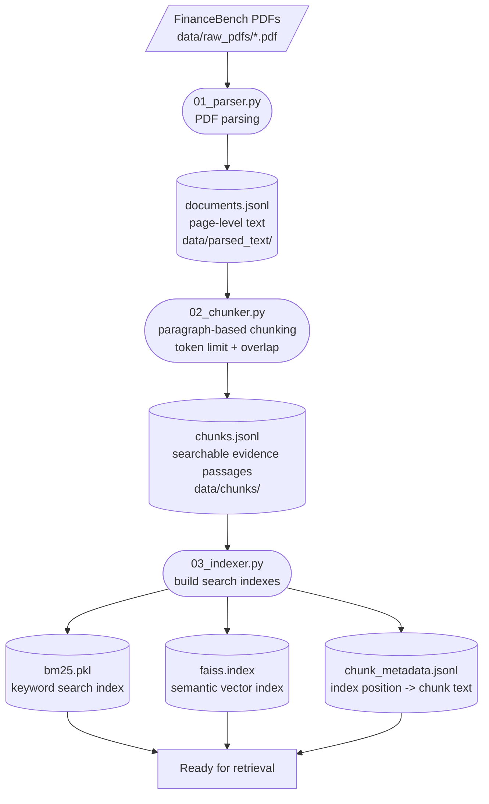
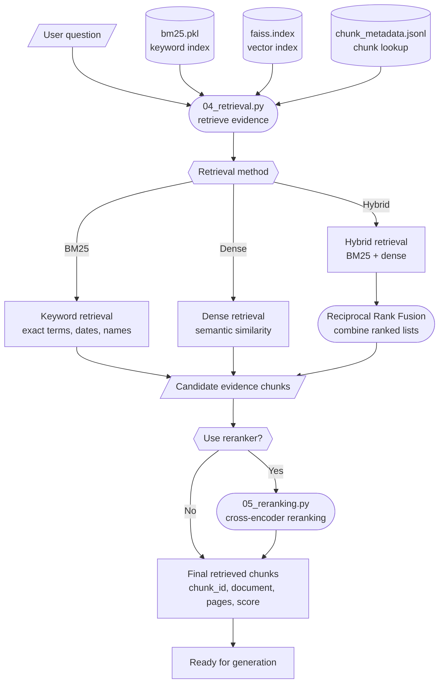

# FinanceRAG Mini

FinanceRAG Mini is a learning project for building an end-to-end Retrieval-Augmented Generation (RAG) system over financial PDF documents using the FinanceBench open-source sample.

The goal is to understand each stage clearly:

```text
PDFs -> parsed text -> chunks -> indexes -> retrieval -> generation -> evaluation
```

This project favors readable, step-by-step code over hiding the workflow inside a framework.

## Pipeline Diagrams

Shape legend:

```text
[/.../]     external input or user input
([...])     Python processing step
[(...)]     saved file or index
{{...}}     method choice or decision
[...]       intermediate output
```

Data preparation and indexing flow:



Query-time retrieval flow:



## Project Structure

```text
FinanceRAG-mini/
├── app/
│   ├── 00_config.py
│   ├── 01_parser.py
│   ├── 02_chunker.py
│   ├── 03_indexer.py
│   ├── 04_retrieval.py
│   ├── 05_reranking.py
│   ├── 06_generation.py
│   ├── 07_rag_pipeline.py
│   ├── 08_evaluation.py
│   └── 09_streamlit_app.py
├── configs/
│   └── config.yaml
├── data/
│   ├── raw_pdfs/
│   ├── parsed_text/
│   ├── chunks/
│   ├── indexes/
│   └── evaluation/
├── notebooks/
├── .env.example
├── .gitignore
├── README.md
├── requirements.txt
└── venv/
```

## Setup

Go to the project folder:

```bash
cd /Users/tuba.gokhan/Desktop/FinanceRAG-mini
```

Create a virtual environment:

```bash
python3 -m venv venv
```

Activate the virtual environment:

```bash
source venv/bin/activate
```

Install libraries:

```bash
pip install -r requirements.txt
```

Create a local `.env` file:

```bash
cp .env.example .env
```

Later, when we reach answer generation, add your OpenAI API key to `.env`.

After the environment already exists, the usual workflow is:

```bash
cd /Users/tuba.gokhan/Desktop/FinanceRAG-mini
source venv/bin/activate
```

## What Each Folder Is For

`app/`

Python source code. Each file represents one stage of the RAG pipeline.

`configs/`

Project settings such as paths, chunk sizes, retrieval settings, and model names.

`data/raw_pdfs/`

FinanceBench PDF documents.

`data/parsed_text/`

Page-level text extracted from PDFs.

`data/chunks/`

Searchable text chunks with metadata.

`data/indexes/`

BM25 and FAISS indexes, plus chunk metadata used during retrieval.

`data/evaluation/`

FinanceBench question/evidence files, evaluation results, and human feedback.

`notebooks/`

Optional exploration notebooks for experiments and inspection.

FinanceBench sources:

- GitHub: https://github.com/patronus-ai/financebench
- Hugging Face: https://huggingface.co/datasets/PatronusAI/financebench

FinanceBench gives us PDFs plus questions, answers, and evidence strings. That lets us learn the full RAG flow from PDFs while still having an evaluation set.

## Step 00: Configuration

File:

```text
app/00_config.py
configs/config.yaml
```

Purpose:

```text
Load project settings and resolve paths.
```

Run:

```bash
python app/00_config.py
```

Why this matters:

```text
Paths, model names, chunk sizes, and retrieval settings should not be hardcoded
inside every script. They live in configs/config.yaml so we can change behavior
from one place.
```

## Step 01: Parse PDFs

File:

```text
app/01_parser.py
```

Input:

```text
data/raw_pdfs/*.pdf
```

Output:

```text
data/parsed_text/documents.jsonl
```

Run with the configured first-run limit:

```bash
python app/01_parser.py
```

Run only 2 PDFs:

```bash
python app/01_parser.py --limit 2
```

Run all PDFs:

```bash
python app/01_parser.py --all
```

Each output record has:

```text
page_id
document_id
document_title
source_file
page_index
page_number
text
char_count
```

Important ID idea:

```text
document_id identifies the whole PDF and repeats for each page.
page_id identifies one exact page record and is unique.
chunk_id is created later by app/02_chunker.py.
```

## Step 02: Create Chunks

File:

```text
app/02_chunker.py
```

Input:

```text
data/parsed_text/documents.jsonl
```

Output:

```text
data/chunks/chunks.jsonl
```

Run after the parser has finished:

```bash
python app/02_chunker.py
```

Run only 2 parsed documents:

```bash
python app/02_chunker.py --limit-documents 2
```

Each output chunk has:

```text
chunk_id
document_id
document_title
source_file
page_start
page_end
source_page_ids
chunk_text
token_count
char_count
```

Important chunking idea:

```text
The parser creates page records.
The chunker creates smaller searchable evidence passages.
The indexer turns those chunks into BM25 and FAISS search indexes.
```

Current chunking strategy:

```text
paragraph-based chunking
+ token-size limit
+ overlap between normal chunks
+ token fallback for very long paragraphs
```

`tiktoken` does not decide the chunking strategy. It only counts tokens.

Common chunking strategies:

```text
Fixed-size chunking
```

Split text every fixed number of tokens or characters.

Pros:

- simple
- predictable
- easy to implement

Cons:

- can cut paragraphs, sentences, tables, or exceptions in the middle
- may break the meaning of financial/legal text

```text
Paragraph-based chunking
```

Split text into paragraphs first, then group paragraphs until a token limit is reached.

Pros:

- keeps related ideas together
- easier to inspect as evidence
- usually better than blind fixed-size splitting for reports and legal-style text

Cons:

- depends on PDF text extraction quality
- paragraphs can still be too short, too long, or badly extracted

```text
Sentence-based chunking
```

Split text into sentences first, then group sentences until a token limit is reached.

Pros:

- avoids cutting sentences in half
- useful for dense prose

Cons:

- sentence detection can fail on abbreviations, tables, headings, and financial notation
- may lose larger paragraph-level context

```text
Section-aware chunking
```

Use headings and document structure, such as `Item 1A`, `Risk Factors`, `Note 7`, or `Management's Discussion and Analysis`.

Pros:

- preserves document structure
- often strong for legal, regulatory, and financial reports

Cons:

- harder to implement
- requires reliable heading detection
- document formats vary across companies and years

```text
Semantic chunking
```

Use embeddings or similarity changes to split text when the topic changes.

Pros:

- can create topic-focused chunks
- useful when structure is unclear

Cons:

- more complex
- slower
- harder to debug while learning

```text
Table-aware chunking
```

Detect and preserve tables separately instead of treating them like normal paragraphs.

Pros:

- very important for financial documents
- helps preserve rows, columns, and numeric context

Cons:

- PDF table extraction is difficult
- may require specialized tools beyond basic PyMuPDF parsing

Why this project starts with paragraph-based chunking:

```text
In financial, legal, and regulatory-style documents, one paragraph often contains
one disclosure, rule, risk, condition, exception, or accounting note. Keeping
paragraphs together helps preserve meaning better than blindly splitting every
600 tokens.
```

The chunker combines small paragraphs until the chunk approaches the configured token size. If one paragraph is too long, it is split by token count as a fallback.

## Step 03: Build Indexes

File:

```text
app/03_indexer.py
```

Input:

```text
data/chunks/chunks.jsonl
```

Outputs:

```text
data/indexes/bm25.pkl
data/indexes/faiss.index
data/indexes/chunk_metadata.jsonl
```

Run a small test:

```bash
python app/03_indexer.py --limit-chunks 500
```

Build only BM25 and metadata, skipping dense embeddings:

```bash
python app/03_indexer.py --skip-dense
```

Build full BM25 and FAISS indexes:

```bash
python app/03_indexer.py
```

What gets built:

```text
BM25 index
```

Keyword search index. Useful when exact words matter, such as company names, dates, accounting terms, financial line items, or legal phrases.

Saved as:

```text
data/indexes/bm25.pkl
```

`bm25.pkl` is a Python pickle file. It stores the BM25 keyword-search object plus the chunk IDs in index order.

```text
FAISS index
```

Dense vector search index. Useful when the question and evidence use different words but have similar meaning.

Saved as:

```text
data/indexes/faiss.index
```

`faiss.index` stores embedding vectors for the chunks. Each chunk is converted into a numeric vector by the embedding model, and FAISS makes those vectors fast to search.

```text
chunk_metadata.jsonl
```

Mapping from index position back to the original chunk text and metadata.

Saved as:

```text
data/indexes/chunk_metadata.jsonl
```

This file is important because BM25 and FAISS return index positions. The metadata file lets us map those positions back to:

```text
chunk_id
document_id
document_title
page_start
page_end
chunk_text
```

Important indexing idea:

```text
BM25 uses tokenized words for exact/keyword matching.
FAISS uses embedding vectors for semantic matching.
Hybrid retrieval later combines both.
```

Simple difference:

```text
bm25.pkl = keyword search
faiss.index = meaning/semantic search
```

Why we use both:

```text
BM25 is strong when exact words matter, such as company names, dates,
financial line items, accounting terms, and specific phrases.

FAISS is strong when the user asks a question using different wording from
the document but the meaning is similar.
```

The dense FAISS step is slower because it must embed every chunk with the configured embedding model.

## Step 04: Retrieve Evidence

File:

```text
app/04_retrieval.py
```

Inputs:

```text
User question
data/indexes/bm25.pkl
data/indexes/faiss.index
data/indexes/chunk_metadata.jsonl
```

Output:

```text
ranked evidence chunks with scores and metadata
```

Run BM25 keyword retrieval:

```bash
python app/04_retrieval.py "What was Netflix revenue in 2017?" --method bm25 --top-k 5
```

Run dense semantic retrieval:

```bash
python app/04_retrieval.py "What was Netflix revenue in 2017?" --method dense --top-k 5
```

Run hybrid retrieval:

```bash
python app/04_retrieval.py "What was Netflix revenue in 2017?" --method hybrid --top-k 5
```

Retrieval methods:

```text
BM25
```

Keyword search. Strong when the question contains exact words that appear in the document.

```text
Dense
```

Semantic vector search. Strong when the question and evidence use different wording but similar meaning.

```text
Hybrid
```

Combines BM25 and dense results using Reciprocal Rank Fusion (RRF).

Why hybrid retrieval:

```text
Financial questions often need exact terms, company names, years, and line items.
They also may be phrased differently from the document text.

BM25 catches exact wording.
Dense retrieval catches similar meaning.
Hybrid retrieval tries to use both strengths.
```

Reciprocal Rank Fusion idea:

```text
If a chunk appears high in BM25 results, it gets points.
If a chunk appears high in dense results, it gets points.
Chunks that rank well in either or both lists rise to the top.
```

## Step 05: Rerank Evidence

File:

```text
app/05_reranking.py
```

Input:

```text
User question
Candidate chunks from app/04_retrieval.py
```

Output:

```text
better ordered evidence chunks
```

Run reranking with hybrid first-stage retrieval:

```bash
python app/05_reranking.py "What was Netflix revenue in 2017?" --method hybrid
```

Run with custom candidate and final result counts:

```bash
python app/05_reranking.py "What was Netflix revenue in 2017?" --method hybrid --candidate-top-k 20 --final-top-k 5
```

What reranking does:

```text
First-stage retrieval finds candidate chunks quickly.
The reranker compares the question and each candidate chunk more carefully.
Then it sorts candidates again using rerank_score.
```

Model used:

```text
cross-encoder/ms-marco-MiniLM-L-6-v2
```

BM25 and dense retrieval score chunks separately. A cross-encoder scores the pair:

```text
(question, candidate chunk)
```

That makes reranking more precise, but slower. It should be used on a small candidate set, such as top 20, not all 112,485 chunks.

## Static vs Dynamic RAG Indexing

This project uses a static corpus:

```text
FinanceBench PDFs -> parse once -> chunk once -> build indexes once
```

For this learning project, we use local index files:

```text
bm25.pkl
```

Local BM25 keyword-search index.

```text
faiss.index
```

Local FAISS vector-search index.

```text
chunk_metadata.jsonl
```

Local metadata mapping from index positions back to chunks.

This local setup is useful for learning because every stage is visible and easy to inspect.

For dynamic or streaming data, such as news pages, the corpus changes over time:

```text
new articles arrive
old articles become stale
articles may be updated
articles may be deleted
```

In that case, the system needs an index update strategy:

```text
fetch new content
parse article
chunk article
embed new chunks
update keyword/vector indexes
retrieve from the latest index
```

For small dynamic projects, we can rebuild indexes periodically:

```text
every hour or every day -> rebuild BM25 and FAISS
```

For production-style systems, dedicated search/vector databases are usually better.

Common tools:

```text
Elasticsearch
```

Strong for keyword search, BM25 ranking, filtering, metadata search, and freshness/date filters.

```text
OpenSearch
```

Open-source search engine similar to Elasticsearch. Strong for keyword search, metadata filtering, and hybrid search patterns.

```text
Pinecone
```

Managed vector database. Strong for semantic search over embeddings at scale.

Other vector database options:

```text
Qdrant
Weaviate
Milvus
```

Simple mapping from this project to production tools:

```text
bm25.pkl             -> Elasticsearch / OpenSearch keyword search
faiss.index          -> Pinecone / Qdrant / Weaviate / Milvus vector search
chunk_metadata.jsonl -> database or document store metadata
```

News-style RAG often also needs:

```text
publication date
source URL
source reliability
freshness ranking
duplicate detection
article update handling
```

So the main difference is:

```text
Static corpus:
  build indexes once

Dynamic corpus:
  update or rebuild indexes regularly
```

## Remaining Steps

Next files will be implemented later:

```text
app/06_generation.py     -> source-grounded LLM answer generation
app/07_rag_pipeline.py   -> orchestration layer
app/08_evaluation.py     -> FinanceBench evaluation
app/09_streamlit_app.py  -> interactive UI
```

## Status

Current status:

```text
PDF parsing complete.
Chunking complete.
Full indexing complete.
Retrieval complete.
Reranking complete.
Next step: generation.
```
