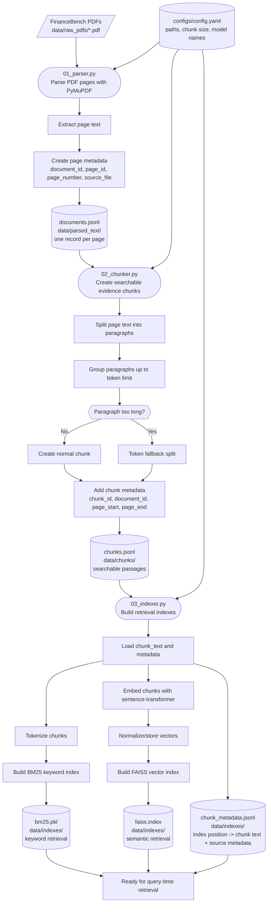
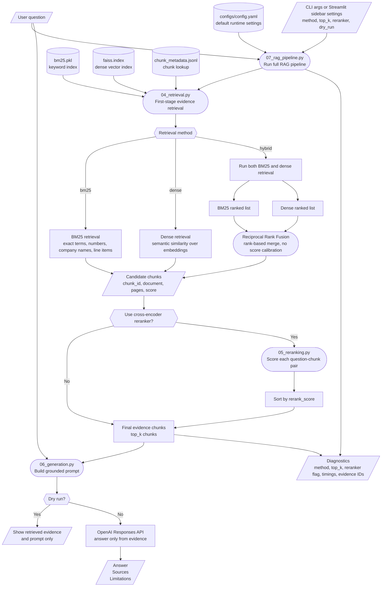
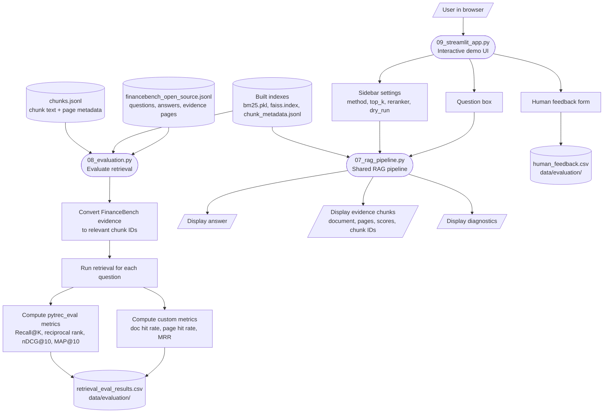

# FinanceRAG Mini

FinanceRAG Mini is a tutorial-style project for building an end-to-end Retrieval-Augmented Generation (RAG) system over financial PDF documents using the open-source FinanceBench sample.

The project is intentionally written as a learning pipeline rather than a black-box framework. Each stage is separated into a small Python module so that you can inspect, run, debug, and improve the system step by step.

```text
PDFs -> parsed text -> chunks -> indexes -> retrieval -> reranking -> generation -> evaluation -> Streamlit demo
```

## What You Will Learn

By completing this project, you will understand how to:

- parse financial PDFs into structured page-level text;
- split extracted text into searchable evidence chunks;
- build a BM25 keyword index;
- build a FAISS dense vector index;
- retrieve evidence with BM25, dense retrieval, and hybrid RRF fusion;
- optionally rerank candidate evidence with a cross-encoder;
- generate grounded answers with citations;
- evaluate retrieval against FinanceBench evidence labels;
- expose the full pipeline through a Streamlit app.

This is not intended to be the most optimized RAG system. It is intended to make the mechanics of RAG visible.

## Table of Contents

1. [Project Overview](#project-overview)
2. [Pipeline Diagrams](#pipeline-diagrams)
3. [Project Structure](#project-structure)
4. [Setup](#setup)
5. [Data Preparation](#data-preparation)
6. [Run Commands: Bash Only](#run-commands-bash-only)
7. [Step-by-Step Tutorial](#step-by-step-tutorial)
   - [Step 00: Configuration](#step-00-configuration)
   - [Step 01: Parse PDFs](#step-01-parse-pdfs)
   - [Step 02: Create Chunks](#step-02-create-chunks)
   - [Step 03: Build Indexes](#step-03-build-indexes)
   - [Step 04: Retrieve Evidence](#step-04-retrieve-evidence)
   - [Step 05: Rerank Evidence](#step-05-rerank-evidence)
   - [Step 06: Generate Grounded Answers](#step-06-generate-grounded-answers)
   - [Step 07: Run the Full RAG Pipeline](#step-07-run-the-full-rag-pipeline)
   - [Step 08: Evaluate Retrieval](#step-08-evaluate-retrieval)
   - [Step 09: Run the Streamlit App](#step-09-run-the-streamlit-app)
8. [Current Evaluation Results](#current-evaluation-results)
9. [Static vs Dynamic RAG Indexing](#static-vs-dynamic-rag-indexing)
10. [Suggested Experiments](#suggested-experiments)
11. [Troubleshooting](#troubleshooting)
12. [Current Status](#current-status)

## Project Overview

FinanceBench provides financial documents, questions, answers, and evidence strings. That makes it useful for learning RAG because you can test not only whether the model produces an answer, but also whether the retrieval layer finds the right source evidence.

FinanceBench sources:

- GitHub: <https://github.com/patronus-ai/financebench>
- Hugging Face: <https://huggingface.co/datasets/PatronusAI/financebench>

This project uses the documents as a static local corpus:

```text
data/raw_pdfs/*.pdf
```

The final system supports three main usage modes:

```text
1. Command-line scripts for each individual RAG stage
2. A single orchestrated RAG pipeline
3. A Streamlit interface for interactive demos
```

## Pipeline Diagrams

The diagrams below show the project at three levels:

1. how the local FinanceBench corpus is prepared and indexed;
2. how a user question moves through retrieval, reranking, and answer generation;
3. how evaluation and Streamlit reuse the same pipeline components.

### Shape Legend

```text
[/.../]     external input or user input
([...])     Python processing step
[(...)]     saved file, cache, or index
{{...}}     method choice or decision
[...]       intermediate output
```

### Build-Time Flow: From PDFs to Search Indexes

This flow is run before asking questions. It converts raw PDFs into page records, chunks, keyword indexes, dense vector indexes, and metadata lookup files.



### Query-Time Flow: From User Question to Grounded Answer

This flow is run every time a user asks a question in the CLI pipeline or the Streamlit app.



### Evaluation and Streamlit Flow

The evaluation script and Streamlit app are separate entry points, but both reuse the same retrieval and pipeline components. This keeps the demo consistent with the command-line experiments.



## Project Structure

```text
FinanceRAG-mini/
├── app/
│   ├── 00_config.py
│   ├── 01_parser.py
│   ├── 02_chunker.py
│   ├── 03_indexer.py
│   ├── 04_retrieval.py
│   ├── 05_reranking.py
│   ├── 06_generation.py
│   ├── 07_rag_pipeline.py
│   ├── 08_evaluation.py
│   └── 09_streamlit_app.py
├── configs/
│   └── config.yaml
├── data/
│   ├── raw_pdfs/
│   ├── parsed_text/
│   ├── chunks/
│   ├── indexes/
│   └── evaluation/
├── notebooks/
├── .env.example
├── .gitignore
├── README.md
├── requirements.txt
└── venv/
```

### Folder Purposes

| Folder | Purpose |
|---|---|
| `app/` | Python source code. Each file represents one stage of the RAG pipeline. |
| `configs/` | Project settings such as paths, chunk sizes, retrieval settings, and model names. |
| `data/raw_pdfs/` | FinanceBench PDF documents. |
| `data/parsed_text/` | Page-level text extracted from PDFs. |
| `data/chunks/` | Searchable text chunks with metadata. |
| `data/indexes/` | BM25 and FAISS indexes, plus chunk metadata used during retrieval. |
| `data/evaluation/` | FinanceBench question/evidence files, evaluation results, and human feedback. |
| `notebooks/` | Optional exploration notebooks for experiments and inspection. |

## Setup

Go to the project folder:

```bash
cd /Users/tuba.gokhan/Desktop/FinanceRAG-mini
```

Create a virtual environment:

```bash
python3 -m venv venv
```

Activate the virtual environment:

```bash
source venv/bin/activate
```

Install dependencies:

```bash
python -m pip install -r requirements.txt
```

Create a local `.env` file:

```bash
cp .env.example .env
```

Add your OpenAI API key to `.env` only when you want to run live answer generation:

```text
OPENAI_API_KEY=your_api_key_here
```

Keep `.env.example` safe and empty:

```text
OPENAI_API_KEY=
```

After the environment already exists, the usual workflow is:

```bash
cd /Users/tuba.gokhan/Desktop/FinanceRAG-mini
source venv/bin/activate
```

If another Python environment is active, call the project interpreter explicitly:

```bash
./venv/bin/python app/07_rag_pipeline.py "What was Netflix revenue in 2017?" --method hybrid --dry-run
```

## Data Preparation

Place FinanceBench PDF documents in:

```text
data/raw_pdfs/
```

Place the open-source FinanceBench question/evidence file in:

```text
data/evaluation/financebench_open_source.jsonl
```

The project assumes the following learning flow:

```text
1. Start with a small number of PDFs.
2. Parse them.
3. Chunk them.
4. Build a small index.
5. Test retrieval.
6. Build the full index.
7. Add generation and evaluation.
8. Run the Streamlit app.
```

## Run Commands: Bash Only

```bash
cd /Users/tuba.gokhan/Desktop/FinanceRAG-mini
python3 -m venv venv
source venv/bin/activate
python -m pip install -r requirements.txt
cp .env.example .env
```

```bash
cd /Users/tuba.gokhan/Desktop/FinanceRAG-mini
source venv/bin/activate
./venv/bin/python app/00_config.py
```

```bash
./venv/bin/python app/01_parser.py --limit 2
./venv/bin/python app/02_chunker.py --limit-documents 2
./venv/bin/python app/03_indexer.py --limit-chunks 500
```

```bash
./venv/bin/python app/04_retrieval.py "What was Netflix revenue in 2017?" --method bm25 --top-k 5
./venv/bin/python app/04_retrieval.py "What was Netflix revenue in 2017?" --method dense --top-k 5
./venv/bin/python app/04_retrieval.py "What was Netflix revenue in 2017?" --method hybrid --top-k 5
```

```bash
./venv/bin/python app/05_reranking.py "What was Netflix revenue in 2017?" --method hybrid --candidate-top-k 20 --final-top-k 5
```

```bash
./venv/bin/python app/06_generation.py "What was Netflix revenue in 2017?" --method hybrid --dry-run
./venv/bin/python app/06_generation.py "What was Netflix revenue in 2017?" --method hybrid --final-top-k 3
./venv/bin/python app/06_generation.py "What was Netflix revenue in 2017?" --method hybrid --use-reranker --final-top-k 3
```

```bash
./venv/bin/python app/07_rag_pipeline.py "What was Netflix revenue in 2017?" --method hybrid --final-top-k 3 --dry-run
./venv/bin/python app/07_rag_pipeline.py "What was Netflix revenue in 2017?" --method hybrid --final-top-k 3
./venv/bin/python app/07_rag_pipeline.py "What was Netflix revenue in 2017?" --method hybrid --use-reranker --candidate-top-k 10 --final-top-k 3
```

```bash
./venv/bin/python app/08_evaluation.py --limit 5
./venv/bin/python app/08_evaluation.py --method bm25 --limit 25
./venv/bin/python app/08_evaluation.py --method dense --limit 25
./venv/bin/python app/08_evaluation.py --method hybrid --limit 25
```

```bash
./venv/bin/python -m streamlit run app/09_streamlit_app.py
```

```bash
./venv/bin/python app/01_parser.py --all
./venv/bin/python app/02_chunker.py
./venv/bin/python app/03_indexer.py
./venv/bin/python app/08_evaluation.py --method bm25 --limit 10000 --top-k 10
./venv/bin/python app/08_evaluation.py --method dense --limit 10000 --top-k 10
./venv/bin/python app/08_evaluation.py --method hybrid --limit 10000 --top-k 10
```

## Step-by-Step Tutorial

## Step 00: Configuration

Files:

```text
app/00_config.py
configs/config.yaml
```

Purpose:

```text
Load project settings and resolve paths.
```

Run:

```bash
./venv/bin/python app/00_config.py
```

Why this matters:

```text
Paths, model names, chunk sizes, and retrieval settings should not be hardcoded
inside every script. They live in configs/config.yaml so we can change behavior
from one place.
```

Typical configuration values include:

```text
input/output paths
chunk size
chunk overlap
embedding model name
retrieval top-k values
RRF settings
generation model name
```

## Step 01: Parse PDFs

File:

```text
app/01_parser.py
```

Input:

```text
data/raw_pdfs/*.pdf
```

Output:

```text
data/parsed_text/documents.jsonl
```

Run with the configured first-run limit:

```bash
./venv/bin/python app/01_parser.py
```

Run only two PDFs:

```bash
./venv/bin/python app/01_parser.py --limit 2
```

Run all PDFs:

```bash
./venv/bin/python app/01_parser.py --all
```

Each output record has:

```text
page_id
document_id
document_title
source_file
page_index
page_number
text
char_count
```

Important ID idea:

```text
document_id identifies the whole PDF and repeats for each page.
page_id identifies one exact page record and is unique.
chunk_id is created later by app/02_chunker.py.
```

At the end of this step, you should be able to inspect `documents.jsonl` and see one record per parsed page.

## Step 02: Create Chunks

File:

```text
app/02_chunker.py
```

Input:

```text
data/parsed_text/documents.jsonl
```

Output:

```text
data/chunks/chunks.jsonl
```

Run after the parser has finished:

```bash
./venv/bin/python app/02_chunker.py
```

Run only two parsed documents:

```bash
./venv/bin/python app/02_chunker.py --limit-documents 2
```

Each output chunk has:

```text
chunk_id
document_id
document_title
source_file
page_start
page_end
source_page_ids
chunk_text
token_count
char_count
```

Important chunking idea:

```text
The parser creates page records.
The chunker creates smaller searchable evidence passages.
The indexer turns those chunks into BM25 and FAISS search indexes.
```

Current chunking strategy:

```text
paragraph-based chunking
+ token-size limit
+ overlap between normal chunks
+ token fallback for very long paragraphs
```

`tiktoken` does not decide the chunking strategy. It only counts tokens.

### Chunking Strategies

| Strategy | Description | Strengths | Weaknesses |
|---|---|---|---|
| Fixed-size chunking | Split every fixed number of tokens or characters. | Simple, predictable, easy to implement. | Can cut paragraphs, sentences, tables, or exceptions in the middle. |
| Paragraph-based chunking | Split into paragraphs, then group paragraphs until a token limit is reached. | Keeps related ideas together and produces readable evidence. | Depends on PDF extraction quality; paragraphs can be badly extracted. |
| Sentence-based chunking | Split into sentences, then group sentences until a token limit is reached. | Avoids cutting sentences in half. | Sentence detection can fail on abbreviations, tables, headings, and financial notation. |
| Section-aware chunking | Use headings such as `Item 1A`, `Risk Factors`, or `Management's Discussion and Analysis`. | Preserves document structure. | Harder to implement across inconsistent filings. |
| Semantic chunking | Use embeddings or similarity shifts to split when the topic changes. | Can create topic-focused chunks. | More complex, slower, and harder to debug while learning. |
| Table-aware chunking | Detect and preserve tables separately. | Very important for financial documents and numeric QA. | PDF table extraction is difficult and may require specialized tools. |

Why this project starts with paragraph-based chunking:

```text
In financial, legal, and regulatory-style documents, one paragraph often contains
one disclosure, rule, risk, condition, exception, or accounting note. Keeping
paragraphs together helps preserve meaning better than blindly splitting every
600 tokens.
```

The chunker combines small paragraphs until the chunk approaches the configured token size. If one paragraph is too long, it is split by token count as a fallback.

At the end of this step, inspect several chunks manually. Good chunks should be readable, should not be too long, and should preserve enough context to answer a question.

## Step 03: Build Indexes

File:

```text
app/03_indexer.py
```

Input:

```text
data/chunks/chunks.jsonl
```

Outputs:

```text
data/indexes/bm25.pkl
data/indexes/faiss.index
data/indexes/chunk_metadata.jsonl
```

Run a small test:

```bash
./venv/bin/python app/03_indexer.py --limit-chunks 500
```

Build only BM25 and metadata, skipping dense embeddings:

```bash
./venv/bin/python app/03_indexer.py --skip-dense
```

Build full BM25 and FAISS indexes:

```bash
./venv/bin/python app/03_indexer.py
```

What gets built:

| File | Meaning |
|---|---|
| `bm25.pkl` | Local BM25 keyword-search index. It stores the BM25 object plus chunk IDs in index order. |
| `faiss.index` | Local dense vector-search index. It stores embedding vectors for chunks. |
| `chunk_metadata.jsonl` | Mapping from index positions back to chunk text and metadata. |

The metadata file is essential because BM25 and FAISS return index positions. The metadata file maps those positions back to:

```text
chunk_id
document_id
document_title
page_start
page_end
chunk_text
```

Important indexing idea:

```text
BM25 uses tokenized words for exact keyword matching.
FAISS uses embedding vectors for semantic matching.
Hybrid retrieval later combines both.
```

Simple difference:

```text
bm25.pkl = keyword search
faiss.index = meaning/semantic search
```

Why use both:

```text
BM25 is strong when exact words matter, such as company names, dates,
financial line items, accounting terms, and specific phrases.

FAISS is strong when the user asks a question using different wording from
the document but the meaning is similar.
```

The dense FAISS step is slower because it must embed every chunk with the configured embedding model.

## Step 04: Retrieve Evidence

File:

```text
app/04_retrieval.py
```

Inputs:

```text
User question
data/indexes/bm25.pkl
data/indexes/faiss.index
data/indexes/chunk_metadata.jsonl
```

Output:

```text
ranked evidence chunks with scores and metadata
```

Run BM25 keyword retrieval:

```bash
./venv/bin/python app/04_retrieval.py "What was Netflix revenue in 2017?" --method bm25 --top-k 5
```

Run dense semantic retrieval:

```bash
./venv/bin/python app/04_retrieval.py "What was Netflix revenue in 2017?" --method dense --top-k 5
```

Run hybrid retrieval:

```bash
./venv/bin/python app/04_retrieval.py "What was Netflix revenue in 2017?" --method hybrid --top-k 5
```

Retrieval methods:

| Method | What it does | When it helps |
|---|---|---|
| BM25 | Keyword search. | Exact company names, years, accounting terms, financial line items. |
| Dense | Semantic vector search. | Questions phrased differently from the document. |
| Hybrid | Combines BM25 and dense results using Reciprocal Rank Fusion. | When both exact wording and semantic similarity matter. |

### Reciprocal Rank Fusion

Hybrid retrieval uses Reciprocal Rank Fusion (RRF):

```text
If a chunk appears high in BM25 results, it gets points.
If a chunk appears high in dense results, it gets points.
Chunks that rank well in either or both lists rise to the top.
```

The key benefit is that RRF uses ranks rather than raw scores. BM25 scores and dense similarity scores are not directly comparable, but their ranks can be fused robustly.

## Step 05: Rerank Evidence

File:

```text
app/05_reranking.py
```

Input:

```text
User question
Candidate chunks from app/04_retrieval.py
```

Output:

```text
better ordered evidence chunks
```

Run reranking with hybrid first-stage retrieval:

```bash
./venv/bin/python app/05_reranking.py "What was Netflix revenue in 2017?" --method hybrid
```

Run with custom candidate and final result counts:

```bash
./venv/bin/python app/05_reranking.py "What was Netflix revenue in 2017?" --method hybrid --candidate-top-k 20 --final-top-k 5
```

What reranking does:

```text
First-stage retrieval finds candidate chunks quickly.
The reranker compares the question and each candidate chunk more carefully.
Then it sorts candidates again using rerank_score.
```

Model used:

```text
cross-encoder/ms-marco-MiniLM-L-6-v2
```

BM25 and dense retrieval score chunks separately. A cross-encoder scores the pair:

```text
(question, candidate chunk)
```

That makes reranking more precise, but slower. It should be used on a small candidate set, such as the top 20, not all chunks.

## Step 06: Generate Grounded Answers

File:

```text
app/06_generation.py
```

Input:

```text
User question
Top evidence chunks from retrieval/reranking
```

Output:

```text
answer with chunk citations and limitations
```

Dry run without calling OpenAI:

```bash
./venv/bin/python app/06_generation.py "What was Netflix revenue in 2017?" --method hybrid --dry-run
```

Generate an answer using retrieved evidence:

```bash
./venv/bin/python app/06_generation.py "What was Netflix revenue in 2017?" --method hybrid --final-top-k 3
```

Generate with reranking:

```bash
./venv/bin/python app/06_generation.py "What was Netflix revenue in 2017?" --method hybrid --use-reranker
```

The dry-run command is useful for learning because it shows exactly what evidence and instructions would be sent to the LLM.

Generation model:

```text
gpt-4o-mini
```

The generator uses OpenAI's Responses API through the installed `openai` Python package.

Important generation rule:

```text
The LLM should answer only from retrieved evidence.
If the evidence is insufficient, it should say so.
It should cite chunk IDs, not invent citations.
```

The prompt asks for:

```text
Answer
Sources
Limitations
```

Verified grounded answer example:

```text
Question:
What was Netflix revenue in 2017?

Answer:
Netflix's revenue in 2017 was $11,692,713,000.

Sources:
[NETFLIX_2017_10K_chunk_0045]
```

Verified insufficient-evidence example:

```text
Question:
Who won the FIFA World Cup in 2018?

Answer:
The provided evidence is insufficient to determine who won the FIFA World Cup in 2018.

Sources:
None
```

This is expected behavior. The retriever will always return some closest chunks, but the generator should refuse to answer when those chunks do not contain relevant evidence.

## Step 07: Run the Full RAG Pipeline

File:

```text
app/07_rag_pipeline.py
```

Input:

```text
User question
Runtime settings from config.yaml or CLI arguments
```

Output:

```text
answer
evidence chunks
prompt
diagnostics
```

Dry run:

```bash
./venv/bin/python app/07_rag_pipeline.py "What was Netflix revenue in 2017?" --method hybrid --final-top-k 3 --dry-run
```

Live answer:

```bash
./venv/bin/python app/07_rag_pipeline.py "What was Netflix revenue in 2017?" --method hybrid --final-top-k 3
```

Live answer with reranking:

```bash
./venv/bin/python app/07_rag_pipeline.py "What was Netflix revenue in 2017?" --method hybrid --use-reranker --candidate-top-k 10 --final-top-k 3
```

Why this file exists:

```text
The Streamlit app and evaluation code should not manually call retrieval,
reranking, prompt construction, and generation separately.

They should call one pipeline function and receive structured output.
```

The main function for other modules is:

```python
run_rag_pipeline(...)
```

## Step 08: Evaluate Retrieval

File:

```text
app/08_evaluation.py
```

Input:

```text
data/evaluation/financebench_open_source.jsonl
retrieval results from app/04_retrieval.py
```

Output:

```text
retrieval metrics
data/evaluation/retrieval_eval_results.csv
```

Run the default evaluation:

```bash
./venv/bin/python app/08_evaluation.py
```

Evaluate only five questions:

```bash
./venv/bin/python app/08_evaluation.py --limit 5
```

Compare retrieval methods:

```bash
./venv/bin/python app/08_evaluation.py --method bm25 --limit 25
./venv/bin/python app/08_evaluation.py --method dense --limit 25
./venv/bin/python app/08_evaluation.py --method hybrid --limit 25
```

What this first evaluation checks:

```text
Did retrieval return a chunk from the gold FinanceBench document?
Did that chunk overlap the gold evidence page?
At what rank did the first matching chunk appear?
```

Custom metrics:

```text
doc_hit_rate_at_1
doc_hit_rate_at_3
doc_hit_rate_at_5
doc_hit_rate_at_10
doc_mrr

page_hit_rate_at_1
page_hit_rate_at_3
page_hit_rate_at_5
page_hit_rate_at_10
page_mrr
```

Standard `pytrec_eval` metrics:

```text
recall_1
recall_3
recall_5
recall_10
recip_rank
ndcg_cut_10
map_cut_10
```

Important evaluation idea:

```text
This is retrieval evaluation, not full answer evaluation.
It checks whether the evidence retrieval layer can find the right source area.
Answer correctness and faithfulness can be evaluated later.
```

Document-level metrics check whether retrieval found the correct filing.

Page-level metrics are stricter and check whether retrieval found a chunk overlapping the gold evidence page. Low page-level scores usually mean the system needs better chunking, table handling, query rewriting, or reranking.

Why use both custom metrics and `pytrec_eval`:

```text
FinanceBench labels evidence by document name and evidence page.
Our retriever returns chunk IDs.

For pytrec_eval, we convert gold document/page evidence into qrels:
question_id -> relevant chunk_ids
```

The custom document-level metrics are useful diagnostics because they tell us whether retrieval found the correct filing even when it missed the exact evidence page.

The `pytrec_eval` metrics are stricter because they evaluate retrieved chunk IDs against gold evidence-page chunk IDs.

## Step 09: Run the Streamlit App

File:

```text
app/09_streamlit_app.py
```

Input:

```text
User question
Retrieval settings from the sidebar
```

Output:

```text
answer
evidence chunks
diagnostics
human feedback CSV
```

Run the app:

```bash
./venv/bin/python -m streamlit run app/09_streamlit_app.py
```

The app provides:

```text
question box
retrieval method selector
top-k evidence control
optional reranker
dry-run mode
answer display
evidence inspection
diagnostics panel
human feedback form
```

Human feedback is saved to:

```text
data/evaluation/human_feedback.csv
```

Use dry-run mode when you want to inspect retrieved evidence and the prompt without calling OpenAI.

### Example Questions for the Streamlit App

Use these to test different parts of the system:

```text
What was Netflix revenue in 2017?
What was Apple’s total net sales in 2022?
Did Apple’s net sales increase or decrease from 2021 to 2022? By how much?
What percentage of Amazon’s 2022 net sales came from AWS?
What was Microsoft’s research and development expense in 2023?
What risks did Meta identify related to advertising revenue?
```

These questions test simple lookup, table lookup, comparison, calculation, and narrative risk retrieval.

## Current Evaluation Results

Latest retrieval evaluation run:

```text
./venv/bin/python app/08_evaluation.py --method bm25 --limit 10000 --top-k 10
./venv/bin/python app/08_evaluation.py --method dense --limit 10000 --top-k 10
./venv/bin/python app/08_evaluation.py --method hybrid --limit 10000 --top-k 10
```

The open-source FinanceBench file used in this project contains 150 questions, so `--limit 10000` still evaluates only 150 questions.

Evaluation setup:

```text
questions = 150
top_k = 10
qrels relevant chunks = 1044
```

### Custom Retrieval Metrics

| Method | doc@1 | doc@3 | doc@5 | doc@10 | doc MRR | page@1 | page@3 | page@5 | page@10 | page MRR |
|---|---:|---:|---:|---:|---:|---:|---:|---:|---:|---:|
| BM25 | 0.140 | 0.193 | 0.273 | 0.353 | 0.193 | 0.047 | 0.060 | 0.080 | 0.100 | 0.061 |
| Dense | 0.187 | 0.340 | 0.447 | 0.640 | 0.300 | 0.073 | 0.160 | 0.207 | 0.287 | 0.132 |
| Hybrid | 0.160 | 0.307 | 0.380 | 0.527 | 0.263 | 0.053 | 0.107 | 0.153 | 0.227 | 0.095 |

### `pytrec_eval` Metrics

| Method | recall@1 | recall@3 | recall@5 | recall@10 | recip_rank | nDCG@10 | MAP@10 |
|---|---:|---:|---:|---:|---:|---:|---:|
| BM25 | 0.013 | 0.020 | 0.030 | 0.039 | 0.061 | 0.036 | 0.024 |
| Dense | 0.015 | 0.050 | 0.065 | 0.083 | 0.132 | 0.075 | 0.043 |
| Hybrid | 0.012 | 0.038 | 0.049 | 0.071 | 0.095 | 0.059 | 0.036 |

Current interpretation:

```text
Dense retrieval is currently strongest.
Hybrid is better than BM25 but worse than dense with the current RRF settings.
Exact evidence-page retrieval is still weak, especially for table-heavy financial questions.
```

Important difference between hit rate and TREC recall:

```text
page_hit_rate_at_10 = "Did we retrieve at least one correct evidence-page chunk?"
recall@10 = "How many of all relevant evidence-page chunks did we retrieve?"

So a page_hit_rate_at_10 value like 0.287 can happen together with a
pytrec_eval recall@10 value like 0.083.

Hit rate is binary per question.
Recall is proportional to the number of relevant chunks recovered.
```

A manual check comparing retrieved chunk IDs against generated qrels matched the `pytrec_eval` Recall@10 result for that question, so the low TREC scores are not just a reporting bug.

This suggests the next retrieval improvements should focus on:

```text
table-aware chunking
better page/evidence alignment
query rewriting
metadata filtering by company/document period
reranking evaluation
hybrid weighting or fusion tuning
```

## Static vs Dynamic RAG Indexing

This project uses a static corpus:

```text
FinanceBench PDFs -> parse once -> chunk once -> build indexes once
```

For this learning project, we use local index files:

| Local file | Production-style equivalent |
|---|---|
| `bm25.pkl` | Elasticsearch / OpenSearch keyword search |
| `faiss.index` | Pinecone / Qdrant / Weaviate / Milvus vector search |
| `chunk_metadata.jsonl` | Database or document-store metadata |

This local setup is useful for learning because every stage is visible and easy to inspect.

For dynamic or streaming data, such as news pages, the corpus changes over time:

```text
new articles arrive
old articles become stale
articles may be updated
articles may be deleted
```

In that case, the system needs an index update strategy:

```text
fetch new content
parse article
chunk article
embed new chunks
update keyword/vector indexes
retrieve from the latest index
```

For small dynamic projects, indexes can be rebuilt periodically:

```text
every hour or every day -> rebuild BM25 and FAISS
```

For production-style systems, dedicated search/vector databases are usually better.

News-style RAG often also needs:

```text
publication date
source URL
source reliability
freshness ranking
duplicate detection
article update handling
```

So the main difference is:

```text
Static corpus:
  build indexes once

Dynamic corpus:
  update or rebuild indexes regularly
```

## Suggested Experiments

After the baseline system works, useful experiments include:

| Experiment | Why it matters |
|---|---|
| Change chunk size and overlap | Tests how context length affects evidence retrieval. |
| Compare BM25, dense, and hybrid retrieval | Shows whether exact keyword matching or semantic retrieval is stronger for this corpus. |
| Tune RRF parameters | Hybrid retrieval may improve if fusion settings are tuned. |
| Add metadata filtering by company/year | FinanceBench questions often target a specific filing. |
| Add table-aware parsing | Many financial answers live in tables. |
| Evaluate reranking systematically | Reranking may improve final top-k evidence even if first-stage retrieval is noisy. |
| Add answer-level evaluation | Retrieval evaluation does not fully measure answer correctness or faithfulness. |

## Troubleshooting

### The app cannot find indexes

Run the earlier stages first:

```bash
./venv/bin/python app/01_parser.py --all
./venv/bin/python app/02_chunker.py
./venv/bin/python app/03_indexer.py
```

Check that these files exist:

```text
data/indexes/bm25.pkl
data/indexes/faiss.index
data/indexes/chunk_metadata.jsonl
```

### Dense indexing is slow

Dense indexing embeds every chunk. Start with a smaller subset:

```bash
./venv/bin/python app/03_indexer.py --limit-chunks 500
```

Then build the full index once the small run works.

### OpenAI generation fails

Check that `.env` exists and contains:

```text
OPENAI_API_KEY=your_api_key_here
```

Also check that you are using the project environment:

```bash
source venv/bin/activate
```

or:

```bash
./venv/bin/python app/06_generation.py "What was Netflix revenue in 2017?" --method hybrid --final-top-k 3
```

### The model answers an unrelated question

Use dry-run mode and inspect the retrieved chunks:

```bash
./venv/bin/python app/07_rag_pipeline.py "Who won the FIFA World Cup in 2018?" --method hybrid --dry-run
```

The generator should refuse when evidence is insufficient. If it does not, improve the prompt or add stricter evidence validation.

### Page-level scores are low

This is expected for a simple baseline over financial PDFs. FinanceBench contains many table-heavy questions, and basic PDF text extraction can lose table structure.

Possible improvements:

```text
table-aware parsing
better page alignment
metadata filtering
reranking
query rewriting
hybrid fusion tuning
```

## Current Status

```text
PDF parsing complete.
Chunking complete.
Full indexing complete.
Retrieval complete.
Reranking complete.
Generation complete and live API call verified.
Pipeline orchestration complete.
Evaluation implemented for retrieval metrics.
Streamlit UI complete.
```

## Recommended Reading Order

If you are using this repository as a tutorial, read and run it in this order:

```text
1. README overview
2. app/00_config.py
3. app/01_parser.py
4. app/02_chunker.py
5. app/03_indexer.py
6. app/04_retrieval.py
7. app/05_reranking.py
8. app/06_generation.py
9. app/07_rag_pipeline.py
10. app/08_evaluation.py
11. app/09_streamlit_app.py
```

The main learning objective is to understand how a raw PDF becomes a grounded answer with evidence.
